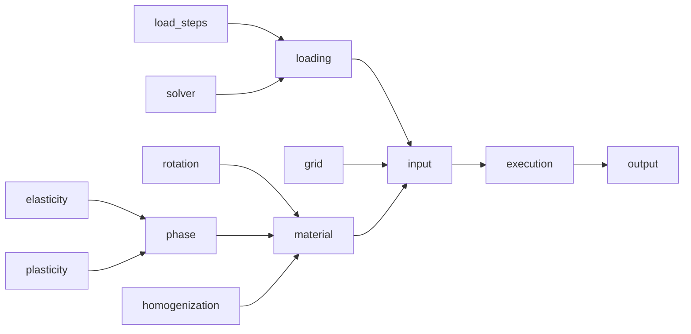

# (Awareness) How to (not) write workflows - lessons I learned from DAMASK

StahlDigital was one of the in-house project of the MPIE in the framework of PMD, so naturally you would expect it to be the easiest one to accomplish and be successful. As you know today, that didn't materialize. Out of huge regret to not have supported the developers at that time, I looked into the project myself after StahlDigital was over, and today I would like to give my insight into the issue, in the hope that it helps you think about how to implement a workflow.

Note: I'm not totally done with the implementation, so I might postpone my contribution to next week.

First of all, you can take a look at [the notebook before I touched it](https://github.com/pyiron/pyiron_continuum/blob/2f28479e421386172a2edc9fce8df62e8551d836/notebooks/damask_tutorial.ipynb). Here's more or less how the workflow looked:



## Lesson I: Create hierarchy of parameters

First thing you notice in the notebook is that all the parameters are listed next to each other. Whether you understand them intuitively or not, it's far far from an actual tool. Let's take on example here:

```python
elasticity = pr.continuum.damask.Elasticity(
    type='Hooke', C_11=106.75e9, C_12=60.41e9, C_44=28.34e9
)

plasticity = pr.continuum.damask.Plasticity(
    type='phenopowerlaw',
    N_sl=[12],
    a_sl=[2.25],
    atol_xi=1.0,
    dot_gamma_0_sl=[0.001],
    h_0_sl_sl=[75.0e6],
    h_sl_sl=[1, 1, 1.4, 1.4, 1.4, 1.4, 1.4],
    n_sl=[20],
    output=['xi_sl'],
    xi_0_sl=[31.0e6],
    xi_inf_sl=[63.0e6]
)  
```

#### Group by what's independent and what's dependent

One possible categorization is by whether the parameter is independent or dependent. For example, `Aluminum` is an independent parameter, while `C_11`, `C_12` and `C_44` are not, because they are the consequences of the material being Al. Accordingly, the dependent parameters should have wisely chosen default values.

#### Group by type of input

In computational materials science, the parameters can be often grouped into:

- Material parameters
- Model parameters
- Process parameters
- Technical parameters

The ones that should be hidden are the technical parameters. In this DAMASK example, that's `composition`, which is not the actual composition, but the name that you give to this particular phase, so that DAMASK can correctly identify the phases, i.e. it can also be called `my_composition`, but it must be used consistently. That's a kind of task computers should take, but not scientists should care about.

| | Material parameters | Model parameters | Process parameters | Technical parameters |
|--|--|--|--|--|
| Independent | Required | Optional | Usually intrinsically included in the workflow | Hidden |
| Dependent | Optional | Hidden | Hidden | Hidden | Hidden |

Note: I don't think it is particularly important to give a unified definition; it should merely correspond to the physics understanding of the workflow.

### How to wisely choose default parameters

Before we talk about default parameters, the first question you should ask is "is this parameter fundamental to the workflow"? A parameter can be considered as a fundamental parameter if that's the input `x` of `y = f(x)` for your workflow **and** if it is a physical parameter, i.e. anyone with physics understanding of the workflow would know how to give it. Otherwise, we should do our maximum effort to give some wisely chosen default parameters. Now, how can we do it?

#### Option I: Include the logic into the workflow

Let's take this example:

```python
phase = get_phase(
    composition='Aluminum',
    lattice='cF',
    output_list=['F', 'P', 'F_e', 'F_p', 'L_p', 'O'],
    elasticity=elasticity,
    plasticity=plasticity
)
```

Here, I'm talking about this esoteric argument `output_list`. This one basically tells DAMASK which output values should be exported to the output file. Now, I cannot remember exactly what they are, but usually you would need only `F`, `P` and `F_e` if the material is elastic, and the other three values when it's plastic. That means within `get_phase` you can check whether `plasticity` was set or not, and internally change `output_list` if it's not set by the user.

#### Option II: Include function to look up

One of the first things I implemented was the function to look up the ground state crystal structure (cf. [this function](https://github.com/samwaseda/damask_local/blob/eeeaa767566e2851d58589591917f7b4a97f2fe1/damask_local/main.py#L168-L177)). With this function, the user has now the possibility of simply writing:

```python
phase = get_phase(composition='Aluminum', elasticity=elasticity, plasticity=plasticity)
```

Instead of
```python
phase = get_phase(composition='Aluminum', lattice='cF', elasticity=elasticity, plasticity=plasticity)
```

#### Option III: Add a workflow step

There are some cases where we can use existing workflow tools to provide elastic constants. In the example above, we can easily provide elastic constants. Moreover, for the parameters that I couldn't straightforwardly provide, I could ask some experts (interface energies etc.), which allowed me to come into contact with new people. So it ended up being my strength to not be able to provide these parameters in the end.

#### Option IV: Create a library

One big challenge that I faced was the choice of plasticity parameters, as shown above in my example. The sheer number of parameters already discouraged me from looking for the options I mentioned above. Luckily, DAMASK provided an [extensive list of parameter sets](https://github.com/damask-multiphysics/DAMASK/tree/master/examples/config/phase/mechanical/plastic), which they called "examples". So I used a GitHub API to provide a [function to retrieve these parameter sets](https://github.com/samwaseda/damask_local/blob/eeeaa767566e2851d58589591917f7b4a97f2fe1/damask_local/main.py#L115). At this point, instead of

```python
plasticity = get_plasticity(
    type='phenopowerlaw',
    N_sl=[12],
    a_sl=[2.25],
    atol_xi=1.0,
    dot_gamma_0_sl=[0.001],
    h_0_sl_sl=[75.0e6],
    h_sl_sl=[1, 1, 1.4, 1.4, 1.4, 1.4, 1.4],
    n_sl=[20],
    output=['xi_sl'],
    xi_0_sl=[31.0e6],
    xi_inf_sl=[63.0e6]
)
```

you got the possibility to write

```python
plasticity_list = list_plasticity()
plasticity = get_plasticity(plasticity_list["phenopowerlaw_Al"])
```

If you happen to have to create a library on your own, or if you ask your project partner (who's interested in creating a workflow like this one) to create a library, it is extremely important to ask them to put as much as metadata as they can, **because** the DAMASK example files did not provide metadata beyond the reference papers, meaning there was also no chemical composition, which made it difficult to look up the parameter sets for a specific composition of the workflow. Therefore, I had to extend the files myself to include this information, which allows me now to change the function above to

```python
plasticity_list = list_plasticity(composition="Al")
plasticity = get_plasticity(list(plasticity_list.values())[0])
```

ok it's a bit clumsy looking but the point is that it runs without esoteric `phenopowerlaw_Al`.

#### Option V: Give some default value

(I take atomistic tools from here on, because I don't think you guys are extremely familiar with the model parameters of DAMASK)

There are some relatively-easy-to-give default values, such as `timestep` in the MD calculations in LAMMPS. There are other parameters which are not easy to determine, such as temperature, which is a little bit tricky, because you might consider it as a fundamental parameter. `pyiron_atomistics` made an extremely dared step of setting `temperature = 300` as the default value for the MD calculations. This is a point where a lot of scientists criticized us for making nonsense workflows. However, while I admit there are few calculations that run indeed at 300 K, if you tell a scientist that pyiron has a default temperature for the MD, I'm sure that they can correctly guess that the value should be 300 K. So even though if we are giving some rare case value, it does not go beyond imagination of an average scientist. Another kind of default value is for example the maximum strain value of EV-curves. The results may depend on this value, but it is usually fine to use something like 5% or 10%.

#### Option VI: Create different workflows

There are cases that the default values are simply extremely different. For example, adsorption energy and surface diffusion would require basically the same calculation, but they require very different temperature ranges. In that case, make one workflow for adsorption energy, and another one for surface diffusion.

#### Option VII: Leave it open, but explain well in the docstring how to determine the value

There are cases where you can simply not give any meaningful default value, such as energy barriers of KMC simulations. In that case, explain the logic, indicate functioning examples or references to other workflows which could do the task. It is extremely important that it's well documented in the docstring!

Speaking of docstring, however you give the default parameters, it is super helpful to document how they were chosen, and what kind of potential problems the user can expect. And make sure to extend it whenever you encounter other problems related to the choice of the default parameters.

## Lesson II: Anticipate wrong input

As a node developer, probably you are a domain expert and might not expect the stupid mistakes users make, but it helps enormously if the workflow manages to catches problems as early as possible.

There are basically the following possibilities: convert, warn or fail

#### Convert

If a function takes chemical symbol as an input, but user gives the name instead, it is safe to perform a conversion silently like this:

```python
def get_lattice_parameter(chemical_symbol):
    if len(chemical_symbol) > 2:
        chemical_symbol = element_name_to_chemical_symbol(chemical_symbol)
    ...
    return lattice_parameter
```

If you prefer, you can also issue a warning in addition.

#### Warn

This very often comes into question when the software tool uses uncommon units or if common units are not well established. DAMASK for example expects the elastic constants in Pa, which is rather uncommon since they are mostly given in GPa. In this case you can issue a warning if the value is let's say smaller than 10^5.

#### Fail

Sometimes it feels really stupid to raise an error when the input is totally wrong, like for example making sure that `temperature >= 0`. However, this kind of stupid checks sometimes helps a lot, because:

- The user might perform a parameter sensitivity study, in which input parameters are changed regardless of their physical meanings
- There might be a mistake in the order of the argument
- And quite obviously, the user might simply not know what this argument means

Of course it's super important to give descriptive/explanatory error messages

## Lesson III: Use Macro to represent hierarchy

## Lesson IV: Do not create your own format

I also wanted to talk about Lesson III and Lesson IV, but I realized that Lesson I got already so long, so I'm gonna leave it to another discussion some time later.